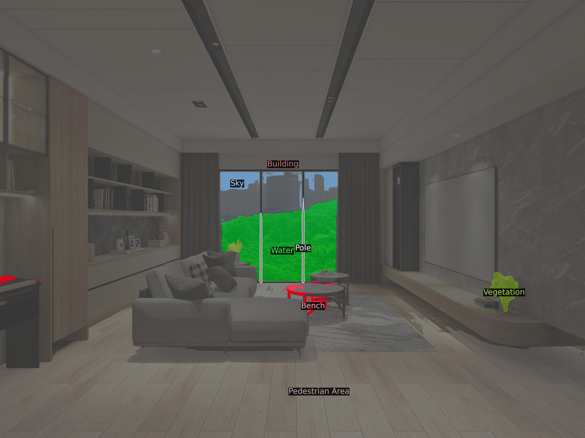
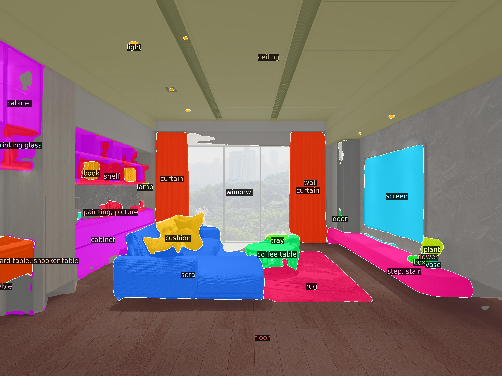
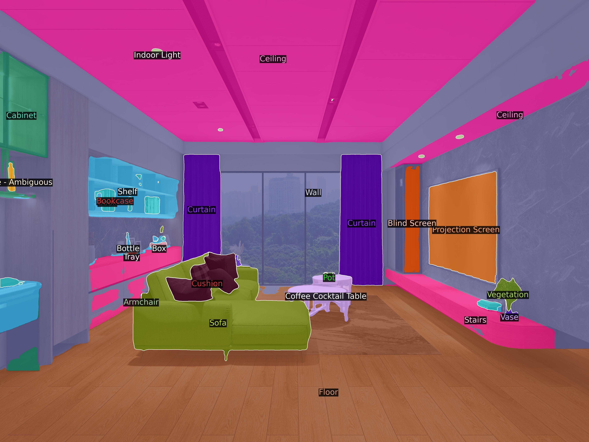
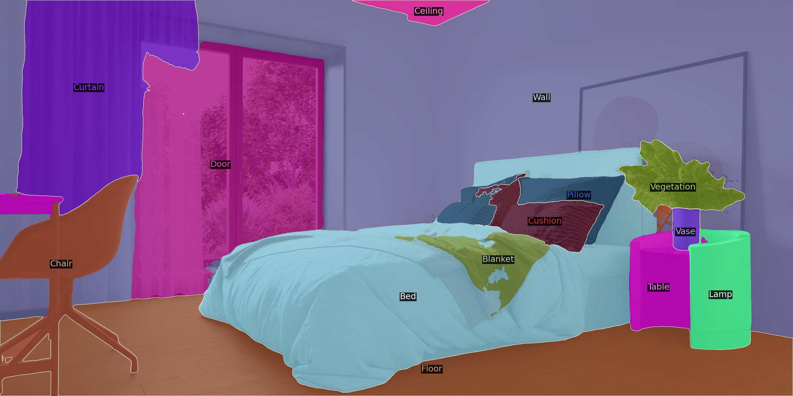

# [ITRI Internship] Mask2Former Retrain with Custom Dataset

This project is largely based on [Mask2Former](https://github.com/facebookresearch/Mask2Former), which is a powerful image segmentation model.

## Why retrain Mask2Former?
Mask2Former is trained on the datasets such as **Mapillary**, **COCO**, **ADE20k**, and **Cityscapes**. Some of these datasets contain rich indoor scenes, while others contain rich outdoor scenes. Therefore, the Mask2Former model trained on these datasets is good at segmenting either indoor scene or outdoor scene. 

However, according to the ITRI's product development roadmap, a dataset that consists of indoor scene and outdoor scene at the same time is indispensible. Especially the recognition of **pavement markings** and **indoor/outdoor stairs**.  

A way to fulfill this requirement is to train Mask2Former model on the dataset which combine Mapillary dataset and ADE20k dataset together. The former encompaasses outdoor scenes while the latter includes indoor scenes. 

## Quick Start
Before diving into the retrain process, please set up the environment according to ["getting started" instructions](GETTING_STARTED.md) and ["installation" instructions](INSTALL.md) provided by Mask2Former development team. You can also refer to the [original repo's README](README_orig.md) for more informations. 

### Dataset Combination
Our goal is to merge Mapillary dataset and ADE20k dataset. We use the class ID of Mapillary as the basis. After combination, the merged dataset will be consisting of 222 classes in total. 

- ```tools/ade20k_to_mapillary_id.json``` is the look-up table which maps the relationship between ADE20k class ID and Mapillary class ID. 
- ```tools/ade_label_transition.py``` is the script that convert the ADE20k annotation to Mapillary-style. Change ```input_dir``` and ```output_dir``` variable to process custom data. Simply do ```python3 tools/ade_label_transition.py```.
- The detail look-up table between class ID and class label is logged in ```tools/Merged_Label_ID_List.csv```

#### Some useful files
- ```tools/retrieve_stair_from_training_set.py```: Find the training images with "stairs." (or whatever class you want by modifying the code)
- ```tools/stair_image_augmentation```: Do the data augmentation to the images that includes "stairs." (or whatever class you want by modifying the code)

### Commands
You can find the commands needed for training or inferring the model below.
#### Training
```bash
python3 train_net.py \
  --config-file <config_path> \
  --num-gpus <num_of_gpu>
```
- Add the training configuration path after ```--config-file``` flag. 
- Set the number of GPU used for training after ```--num-gpus``` flag. 
```bash
# for example
python3 train_net.py \
  --config-file configs/merged/merged_semantic_R50_bs16_300k.yaml \
  --num-gpus 1
```

#### Image Inferring
```bash
cd demo/
python3 demo.py --config-file <config_path> \
  --input <input_img_path> \
  --output <output_img_path> \
  --opts MODEL.WEIGHTS <model_path>
```
- Add the training configuration path after ```--config-file``` flag. 
- Set the input image path after ```--input``` flag.
- Set the output image path after ```--output``` flag.
- Set the ckpt path after ```--opts MODEL.WEIGHTS``` flag. 

```bash
# for example
python3 demo.py --config-file ../configs/mapillary-vistas/semantic-segmentation/maskformer2_R50_bs16_300k.yaml \
  --input ../input/dog_stair.png \
  --output ../demo_output \
  --opts MODEL.WEIGHTS ../ckpt/merged/model_0014999.pth
```

#### Video Inferring
```bash
cd demo/
python3 demo.py --config-file <config_path> \
  --video-input <input_video_path> \
  --output <output_video_path> \
  --opts MODEL.WEIGHTS <model_path>
```
- Add the training configuration path after ```--config-file``` flag. 
- Set the input video path after ```--video-input``` flag.
- Set the output video path after ```--output``` flag.
- Set the ckpt path after ```--opts MODEL.WEIGHTS``` flag. 

## Results
### Before Retrain
#### Outdoor
<table style="width: 100%; table-layout: fixed;">
  <tr>
    <td style="width: 50%; vertical-align: top;">
      <div style="width: 100%; text-align: center;">
        
        <div style="margin-top: 8px;">Mapillary</div>
      </div>
    </td>
    <td style="width: 50%; vertical-align: top;">
      <div style="width: 100%; text-align: center;">
        
        <div style="margin-top: 8px;">ADE20K</div>
      </div>
    </td>
  </tr>
</table>

The results show that, without retrain, the model trained on Mapillary dataset can segment **pavement markings** well but cannot segment anything to do with **stairs**. On the other hand, the model trained on ADE20k dataset are able to segment **stairs** but it cannot detect **pavement markings** at all. 

#### Indoor
<table style="width: 100%; table-layout: fixed;">
  <tr>
    <td style="width: 50%; vertical-align: top;">
      <div style="width: 100%; text-align: center;">
        
        <div style="margin-top: 8px;">Mapillary</div>
      </div>
    </td>
    <td style="width: 50%; vertical-align: top;">
      <div style="width: 100%; text-align: center;">
        
        <div style="margin-top: 8px;">ADE20K</div>
      </div>
    </td>
  </tr>
</table>

For indoor scenes, the difference of segmentation effect between the two models is more significant. 

### After Retrain
#### Outdoor
<table style="width: 100%; table-layout: fixed;">
  <tr>
    <td style="width: 50%; vertical-align: top;">
      <div style="width: 100%; text-align: center;">
        
        <div style="margin-top: 8px;">Outdoor Scene 1</div>
      </div>
    </td>
    <td style="width: 50%; vertical-align: top;">
      <div style="width: 100%; text-align: center;">
        
        <div style="margin-top: 8px;">Outdoor Scene 2</div>
      </div>
    </td>
  </tr>
</table>

After retrain, the model is able to segment **pavement markings** and **stairs** at the same time. 

#### Indoor
<table style="width: 100%; table-layout: fixed;">
  <tr>
    <td style="width: 50%; vertical-align: top;">
      <div style="width: 100%; text-align: center;">
        
        <div style="margin-top: 8px;">Living Room</div>
      </div>
    </td>
    <td style="width: 50%; vertical-align: center;">
      <div style="width: 100%; text-align: center;">
        
        <div style="margin-top: 8px;">Bedroom</div>
      </div>
    </td>
  </tr>
</table>

The segmentation of indoor scenes are even better than the model trained on ADE20k dataset only. 

## Related Porjects
- [NVIDIA TAO Mask2Former Speedup](https://github.com/waynechu1109/-ITRI-TAO_Mask2Former_Speedup.git)
- [Mask2Former Real-Time Video Inference](https://github.com/waynechu1109/-ITRI-Mask2Former_Deployment.git)

## Acknowledgement
Code is largely based on MaskFormer (https://github.com/facebookresearch/MaskFormer) and Mask2Former (https://github.com/facebookresearch/Mask2Former).